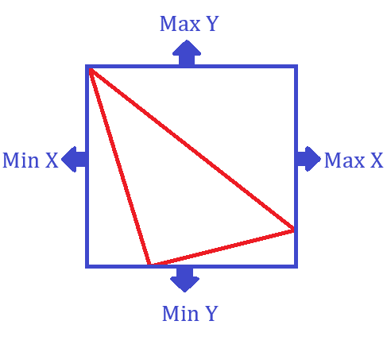
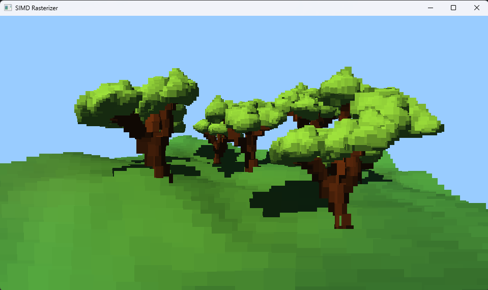

# SIMD Rasterizer
A week-long project to learn a bit about SIMD and software rasterization.

As you can see - Instead of triangles it uses "Patches".

A "Patch" is an axis aligned bounding box wrapped around a single triangle. Drawing them is much cheaper than rasterizing a whole triangle with barycentrics. Shading them is also much cheaper since they are shaded once per-patch. The main limiting factor is now fill rate not being high enough to draw many single-colored rectangles on the screen.

# Meshes
The rasterizer uses the `.ply` format for meshes because it allows to easily save vertex colors per-vertex which are responsible for the final color of patches.

# Benchmarks
The analyzed frame at 960x540 resolution:

The below table shows the average duration of drawing a single frame:

|                        | Clang (18.1.8) | GCC (14.2.0) | MSVC (19.38.33135) |
|------------------------|----------------|--------------|--------------------|
| Manual SIMD Intrinsics | 2.68ms         | 4.01ms       | 3.48ms             |
| No manual SIMD         | 2.69ms         | 4.03ms       | 4.63ms             |

`Manual SIMD Intrinsics` test defined `MATH_ENABLE_SIMD` in the `math_config.hpp` file.

`No Manual SIMD` test did not define `MATH_ENABLE_SIMD` in the `math_config.hpp` file. The compilers had to optimize the math functions themselves.

Compilation flags for GCC and Clang: `-O3 -mavx -mavx2 -msse -msse2 -msse3 -msse4 -msse4.1 -msse4.2`

Compilation flags for MSVC: `/O2 /Qpar`

According to the gathered data it is clearly visible that in this particular case both Clang and GCC optimized the math functions almost perfectly basically making the manual SIMD optimizations pointless. MSVC was the only one that benefited from manual SIMD optimizations (24.8% improvement). 